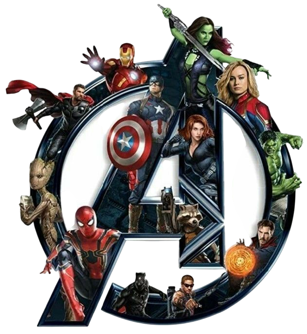

# Avengers Characters Webpage

A visually engaging web application showcasing Avengers characters, their movies, and related information. Built with React, Vite, and Tailwind CSS.

## Table of Contents
- [Features](#features)
- [Project Structure](#project-structure)
- [Getting Started](#getting-started)
- [Customization](#customization)
- [Screenshots](#screenshots)
- [Technologies Used](#technologies-used)
- [Contributing](#contributing)
- [Credits](#credits)
- [License](#license)

## Features
- Browse a gallery of Avengers characters with images and details
- Explore a timeline of Marvel movies
- Themed UI with color mode support (light/dark mode)
- Responsive design for all devices
- Easy customization of character and movie data

## Project Structure
```
├── public/                # Static assets (character images, movie posters, logos)
│   └── movies/            # Movie poster images
├── src/
│   ├── App.jsx            # Main React component
│   ├── App.css            # App-level styles
│   ├── main.jsx           # React entry point
│   ├── index.css          # Global styles (Tailwind)
│   ├── ColorThemeContext.jsx # Theme context provider
│   ├── assets/
│   │   ├── characters.js  # Character data
│   │   └── ...            # SVGs, fonts
│   ├── components/
│   │   ├── CharacterInfo.jsx
│   │   ├── HeroSection.jsx
│   │   ├── Movies.jsx
│   │   ├── Navbar.jsx
│   │   └── Timeline.jsx
├── index.html             # Main HTML file
├── package.json           # Project metadata and scripts
├── vite.config.js         # Vite configuration
├── tailwind.config.js     # Tailwind CSS configuration
├── postcss.config.js      # PostCSS configuration
├── eslint.config.js       # ESLint configuration
```

## Getting Started

### Prerequisites
- Node.js (v16+ recommended)
- npm or yarn

### Installation
```sh
npm install
```

### Development
```sh
npm run dev
```
Open [http://localhost:5173](http://localhost:5173) to view the app.

### Build for Production
```sh
npm run build
```

### Preview Production Build
```sh
npm run preview
```

## Customization
- Add or update character images in `public/`
- Edit character data in `src/assets/characters.js`
- Update movie posters in `public/movies/`
- Modify UI components in `src/components/`
- Add custom fonts in `src/assets/fonts/` or `src/assets/Additional Fonts/`

## Screenshots
Add screenshots of your app here:


<!-- Add more screenshots as needed -->

## Technologies Used
- [React](https://react.dev/)
- [Vite](https://vitejs.dev/)
- [Tailwind CSS](https://tailwindcss.com/)
- [ESLint](https://eslint.org/)

## Contributing
Contributions are welcome! To contribute:
1. Fork the repository
2. Create a new branch (`git checkout -b feature/your-feature`)
3. Commit your changes (`git commit -m 'Add some feature'`)
4. Push to the branch (`git push origin feature/your-feature`)
5. Open a pull request

## Credits
- Marvel Studios for character images and movie posters
- [Hero Patterns](https://www.heropatterns.com/) for background patterns
- Fonts from [Google Fonts](https://fonts.google.com/) and other free sources
- Developed with assistance from Visual Studio Copilot

## License
This project is for educational and personal use. All character images and movie posters are property of Marvel Studios and their respective owners.
